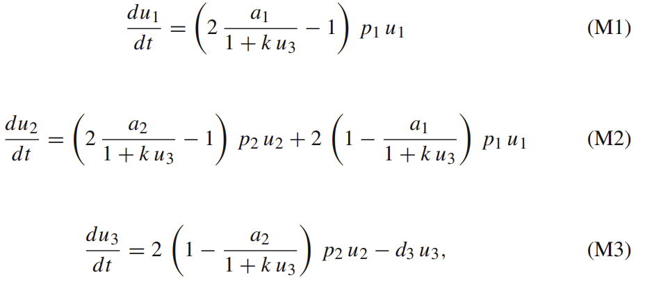
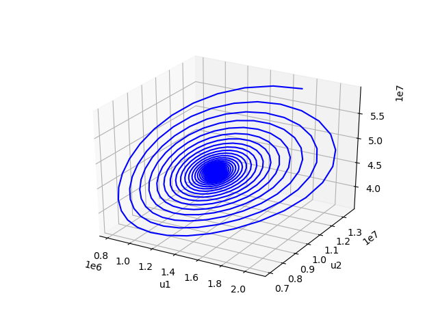
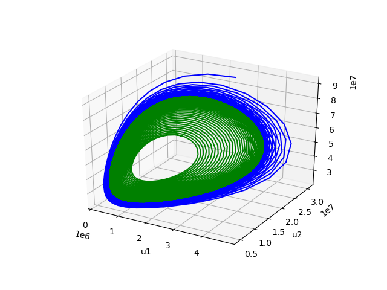

# cancer-cell-population-dynamic

For this project I tried to analyze the survival rate of two types of cancer cells: truth teller, which intentionally signal that they are non-functional cells and liar, which doesn't. Truth teller cells are much more likely to be attacked by immune cells but studies shows that truth teller cells outperform liar cells. The initial guess [professor Griffin](http://www.personal.psu.edu/cxg286/) and I made is that the existence of truth telling cells could overwhelm the immune system so we first built this model of differential equations.

To better understand the production of immune cells, I reproduced results from differential equation model that represents three stages of immune cell production in [this paper](https://arxiv.org/pdf/1812.02017.pdf).

I wrote a python program to produce phase portrait based on those differential equations and got results similar to those in the paper. Here are my results
 

Unfortunately, I was too busy with my classwork and another research project so I stopped at this point. You can find the python programs I wrote for this project [here](https://github.com/yunongch/cancer-cell-population-dynamic/tree/main/code)
